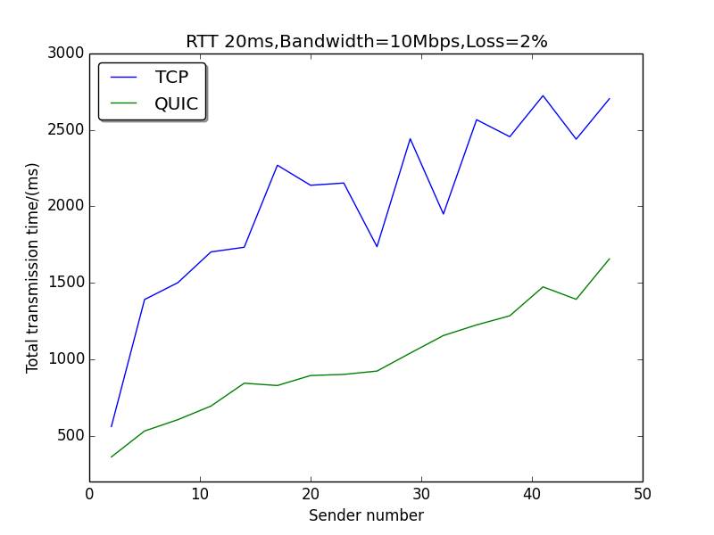

# MQTT_on_QUIC
The ultimate goal is to migrate MQTT from TCP to QUIC and evaluate its performance.
Partial results are gathered. However, the result is under refined investigation.
It may still be a ongoing project in future.

## Milestones
- [x] Implement SurgeMQ test Clients
- [x] Get QuicGo server/client work(learn the interface)
- [x] Evaluate SurgeMQ(plain) test Client in Mininet
- [x] Migrate SurgeMQ to QUIC
- [x] Evaluate SurgeMQ(QUIC) test Client in Mininet

## Method for migration:
We map the TCP connection to QUIC stream in MQTT implementation. However, it is also possible to map topics as seperate QUIC streams to avoid Head of Line Blocking(May be done in future).

## Note for the structure of this project
Basically, QuicEcho include a plain echo server and client implementation for QUIC and TCP.
QuicMQ include a testing MQTT server and client implementation on QUIC and TCP respectively. Only Golang is required for running them. The "github.com" and "golang.org" is the dependency library package for these applications.

The "surgemqQuicService" in "github.com" folder is modified version of surgemq module where in Quic version all TCP socket connection is replaced with Quic socket connection. You may need to investigate it depending what you want to explore in QuicMQ.

The python script in "src" is the measurement script we write for data collection. It directly require Mininet emulator for setting up network topology. We actually run it in a VirtualBox image which was included in the Readme reference.

## What we Found
- QUIC stream perform better than TCP connection in lossy condition but not in perfect network
 
 

- MQTT with QUIC perform better than MQTT with TCP in perfect network and especially when payload is small

## Working Environment Dependency
1. QUIC-go: https://github.com/lucas-clemente/quic-go
2. SurgeMQ: https://github.com/surgemq/surgemq(Clear implementation but with lots of bugs)
3. Golang 1.9
4. Mininet 2.2 on Ubuntu 14.04LTS 64bit(https://github.com/mininet/mininet/wiki/Mininet-VM-Images)

## Usage Instruction:
1. Set environment variable $GOPATH to proper path.

## Reference:
1. Taking a Long Look at QUIC(https://conferences.sigcomm.org/imc/2017/papers/imc17-final39.pdf)
2. draft-ietf-quic-transport-10(https://datatracker.ietf.org/doc/draft-ietf-quic-transport/)
3. MQTT Specification(http://docs.oasis-open.org/mqtt/mqtt/v3.1.1/os/mqtt-v3.1.1-os.html)

